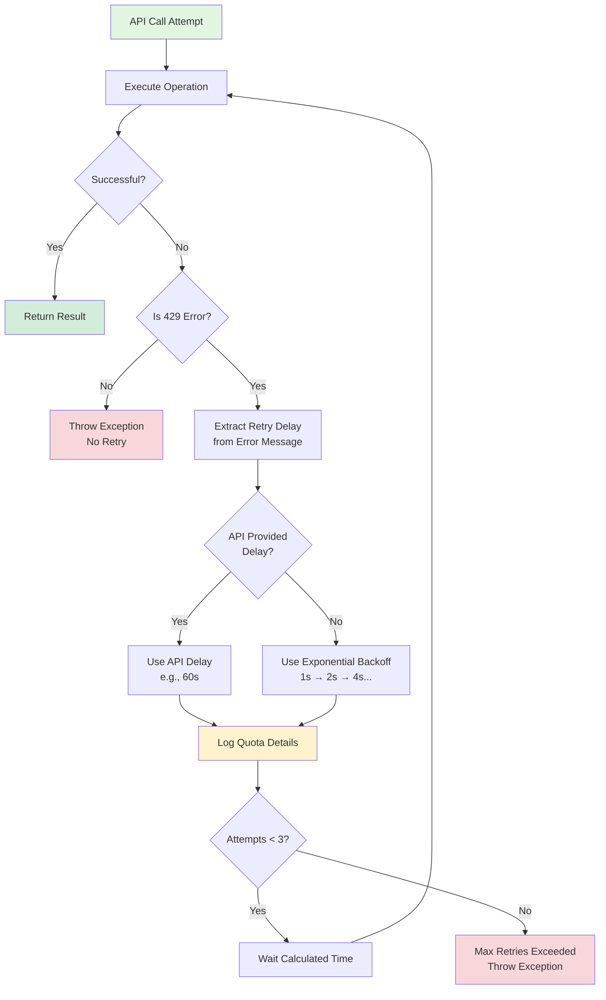

# Rate Limiting and Retry Handling

The Kubernetes AI Agent implements intelligent retry logic to handle Gemini API rate limits (429 errors), matching the behavior of the rollouts-plugin-metric-ai.

## How It Works

### Exponential Backoff Configuration

```java
Initial delay: 1 second
Max delay: 60 seconds
Multiplier: 2.0
Max retries: 3
```

### 429 Error Detection

The agent detects rate limit errors by checking for:
- HTTP status code `429`
- Message containing "quota"
- Message containing "rate limit"
- Message containing "RESOURCE_EXHAUSTED"
- Message containing "exceeded your current quota"

### API-Suggested Wait Time

The agent parses Gemini API error messages to extract retry delays:

```
Error: "Please retry in 59.955530121s"
→ Agent waits 60 seconds (rounded up)
```

This overrides exponential backoff when the API provides specific timing.

### Quota Violation Logging

When a 429 error occurs, the agent logs:
- Quota metric name
- Limit value
- Link to documentation

Example log output:
```
WARN Rate limit exceeded for Gemini API analysis, API suggests waiting 60 seconds
WARN Quota violation details:
WARN   - Metric: generativelanguage.googleapis.com/generate_content_free_tier_requests
WARN   - Limit: 10
WARN   - For more info: https://ai.google.dev/gemini-api/docs/rate-limits
INFO Waiting 60 seconds before retry...
```

## Retry Flow



## Implementation

### RetryHelper Class

Located in: `src/main/java/org/csanchez/adk/agents/k8sagent/utils/RetryHelper.java`

Key methods:
- `executeWithRetry()` - Main retry wrapper
- `is429Error()` - Detects rate limit errors
- `extractRetryDelay()` - Parses API-suggested delays
- `logQuotaDetails()` - Logs quota violation information

### Usage in A2AController

The agent execution is wrapped in retry logic:

```java
List<String> responses = RetryHelper.executeWithRetry(() -> {
    Flowable<Event> events = runner.runAsync(
        request.getUserId(),
        session.id(),
        userMsg
    );
    
    // Collect and return results
    ...
}, "Gemini API analysis");
```

## Benefits

1. **Resilience**: Automatically recovers from transient rate limits
2. **Intelligent Delays**: Uses API-provided timing when available
3. **Cost Effective**: Prevents wasted retries with exponential backoff
4. **Observability**: Detailed logging of quota issues
5. **Consistent Behavior**: Matches rollouts-plugin-metric-ai implementation

## Gemini API Rate Limits

### Free Tier Limits (as of 2024)
- **Requests per minute (RPM)**: 15
- **Requests per day (RPD)**: 1,500  
- **Tokens per minute (TPM)**: 1 million

### When Limits Are Hit

The agent will:
1. Log the quota violation with details
2. Wait the suggested time (or use exponential backoff)
3. Retry up to 3 times
4. If all retries fail, return an error response

### Upgrade Options

For production use with high traffic:
1. Upgrade to Gemini API Pro tier
2. Use Azure OpenAI (configure in plugin)
3. Implement request queuing/throttling
4. Monitor quota usage proactively

## Testing

To test retry behavior, you can:

1. **Trigger rate limiting** by making multiple rapid requests
2. **Check logs** for retry behavior:
   ```bash
   kubectl logs -n argo-rollouts -l app=kubernetes-agent -f | grep -E "(Rate limit|retry|Quota)"
   ```

3. **Monitor retries** in the application logs:
   ```bash
   kubectl logs -n argo-rollouts deploy/kubernetes-agent | grep "attempt"
   ```

## Configuration

Currently hardcoded in `RetryHelper.java`. To make configurable, add to `application.properties`:

```properties
# Retry configuration (future enhancement)
retry.max-attempts=3
retry.initial-backoff-ms=1000
retry.max-backoff-ms=60000
retry.multiplier=2.0
```

## Related

- Go implementation: `rollouts-plugin-metric-ai/internal/plugin/ai.go`
- Gemini rate limits: https://ai.google.dev/gemini-api/docs/rate-limits
- Error details: https://cloud.google.com/apis/design/errors

