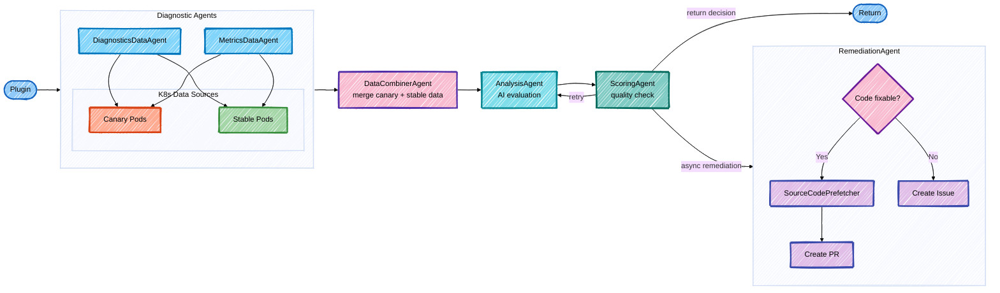

# Software Analysis and Remediation AI Agent

[](https://github.com/kdubois/kubernetes-aiops-agent/actions/workflows/build.yml)

An autonomous AI agent for Kubernetes software delivery debugging and remediation, powered by Quarkus LangChain4j with support for Google Gemini AI and OpenAI.

## Overview

The Kubernetes Agent is an intelligent system that:

- **Debugs** Kubernetes pods automatically
- **Analyzes** logs, events, and metrics
- **Identifies** root causes of issues
- **Creates** GitHub pull requests with fixes
- **Integrates** with Argo Rollouts for canary analysis

## Testing

The agent can automatically analyze and diagnose production issues. Test with realistic scenarios using the demo application in the `argo-rollouts-quarkus-demo` directory.

See the [Demo Script](../argo-rollouts-quarkus-demo/DEMO_SCRIPT.md) for detailed testing scenarios including:
- **Happy Path**: Successful deployment with AI analysis
- **NullPointerException Bug**: Bug detection with automatic rollback and PR creation
- **Memory Leak**: Performance issue detection with automatic rollback

### Quick Test

```bash
# Test the agent with the demo application
cd ../argo-rollouts-quarkus-demo
./test-scenarios.sh
```

## Features

### Kubernetes Debugging Tools

- **Pod Debugging**: Analyze pod status, conditions, and container states
- **Events**: Retrieve and correlate cluster events
- **Logs**: Fetch and analyze container logs (including previous crashes)
- **Metrics**: Check resource usage and limits
- **Resources**: Inspect related deployments, services, and configmaps

### Remediation Capabilities

- **Source Code Analysis**: Read repository files to understand code structure and make informed fixes
- **Git Operations**: Clone, branch, commit, push (using JGit library)
- **Line-Based Patching**: Surgical code fixes using precise line-level changes
- **GitHub PRs**: Automatically create pull requests with:
    - Root cause analysis
    - Code fixes based on actual source code
    - Testing recommendations
    - Links to Kubernetes resources
- **Validation**: Built-in checks to prevent bad PRs (excessive deletions, structural damage)

### Source Code Access

The remediation agent can read source files from the repository to make more accurate fix decisions:

- **On-Demand File Reading**: Agent requests specific files only when needed
- **Batch Operations**: Read multiple files in a single operation for efficiency
- **Common Use Cases**:
  - Analyze configuration files (`application.properties`, YAML configs)
  - Review dependency files (`pom.xml`, `build.gradle`, `package.json`)
  - Examine application code referenced in error logs
  - Identify exact line numbers for precise fixes
- **Smart Analysis**: Agent uses actual source code context to propose better fixes

**Example**: When detecting a NullPointerException in logs, the agent can:
1. Read the source file mentioned in the stack trace
2. Analyze the actual code structure
3. Propose a surgical fix targeting only the buggy line
4. Create a PR with precise line-based changes
5. Validate the patch to prevent accidental code deletion

**Line-Based Patching**: The agent uses surgical precision to fix bugs:
- **Replace**: Fix the exact buggy line (e.g., `nullString.length()` → `versionUpper.length()`)
- **Insert**: Add new lines (e.g., null checks, validation)
- **Delete**: Remove problematic lines (used sparingly)
- **Validation**: Warns about potentially destructive changes (deleting return statements, closing braces, etc.)

### A2A Communication

- **REST API**: Expose analysis capabilities via HTTP
- **Integration**: Works with `rollouts-plugin-metric-ai` for canary analysis

## Architecture



## CI/CD

The project uses GitHub Actions for automated builds and deployments:

- **Automated Builds**: Every push to `main` triggers a build, runs tests, and pushes container images to GitHub Container Registry (GHCR)
- **Test Coverage**: Code coverage reports are automatically uploaded to Codecov
- **Pull Request Validation**: PRs are built and tested automatically without pushing images
- **Container Images**: Available at `ghcr.io/kdubois/kubernetes-agent`
- **Dependency Management**: Dependabot automatically creates PRs for Maven dependencies, GitHub Actions, and Docker base images

Container images are tagged with:
- `latest` for the main branch
- Version tags for releases (e.g., `v1.0.0`)
- SHA-based tags for all builds

## Prerequisites

- Java 21+
- Maven 3.8+
- Kubernetes cluster
- Google API Key (Gemini) or OpenAI API Key
- GitHub Personal Access Token (with `repo` scope)

## Local Development

### 1. Set environment variables

```bash
export ANALYSIS_API_KEY="your-api-key"   # Any OpenAI-compatible API key
export GITHUB_TOKEN="your-github-token"
```

### 2. Run locally

```bash
mvn quarkus:dev

# Server starts on port 8080
# Health check: http://localhost:8080/q/health
```

### 3. Run locally in console mode

```bash
# Interactive console mode for testing
mvn quarkus:dev -Drun.mode=console

# Or use the convenience script
./run-console.sh
```

## Deployment to Kubernetes

### 1. Build Docker image

```bash
# Build with Maven
mvn clean package -Dquarkus.profile=prod,gemini

# Build Docker image
docker build -f src/main/docker/Dockerfile.jvm -t quay.io/kevindubois/kubernetes-agent:latest .

# Push to registry
docker push quay.io/kevindubois/kubernetes-agent:latest
```

Or directly with Quarkus:

```bash
# Build and push in one command
mvn quarkus:image-push -Dquarkus.container-image.build=true -Dquarkus.profile=prod,gemini
```


### 2. Create secrets

```bash
# Copy template
cp deployment/secret.yaml.template deployment/secret.yaml

# Edit secret.yaml and add your keys
# Then apply:
kubectl apply -f deployment/secret.yaml
```

### 3. Deploy agent

```bash
# Deploy using Kustomize
kubectl apply -k deployment/

# Verify deployment
kubectl get pods -n openshift-gitops | grep kubernetes-agent
```

**Note**: The default namespace is `openshift-gitops`. Update `deployment/kustomization.yaml` if deploying to a different namespace.

### 4. Verify deployment

```bash
# Check pods
kubectl get pods -n openshift-gitops | grep kubernetes-agent

# Check logs
kubectl logs -f deployment/kubernetes-agent -n openshift-gitops

# Test health endpoint
kubectl port-forward -n openshift-gitops svc/kubernetes-agent 8080:8080
curl http://localhost:8080/q/health
```

### 5. Run tests

The `test-agent.sh` script supports both Kubernetes and local modes:

```bash
# Test agent running in Kubernetes (default)
./test-agent.sh k8s

# Test agent running locally on localhost:8080
./test-agent.sh local

# Use custom local URL
LOCAL_URL=http://localhost:9090 ./test-agent.sh local

# Use custom Kubernetes context
CONTEXT=my-k8s-context ./test-agent.sh k8s
```

The test script will:
1. ✅ Check health endpoint
2. ✅ Send a sample analysis request
3. ✅ Verify no errors in logs (K8s mode only)

## Usage

### Direct Console Mode

```bash
# Run console mode
./run-console.sh

# Or manually:
mvn quarkus:dev -Dquarkus.profile=dev,gemini -Drun.mode=console

# Example interaction:
You > Debug pod my-app-canary in namespace production

Agent > Analyzing pod my-app-canary in namespace production...
[Agent gathers debug info, logs, events...]

Root Cause: Container crashloop due to OOMKilled - memory limit too low

Recommendation:
1. Increase memory limit from 256Mi to 512Mi
2. Add resource requests to prevent overcommitment
3. Review memory usage patterns in logs
```

### A2A Integration

The agent exposes a REST API for other systems to use:

**Endpoint**: `POST /a2a/analyze`

**Request**:
```json
{
	"userId": "argo-rollouts",
	"prompt": "Analyze canary deployment issue. Namespace: rollouts-test-system, Pod: canary-demo-xyz",
	"context": {
		"namespace": "rollouts-test-system",
		"podName": "canary-demo-xyz",
		"stableLogs": "...",
		"canaryLogs": "..."
	}
}
```

**Response**:
```json
{
	"analysis": "Detailed analysis text...",
	"rootCause": "Identified root cause",
	"remediation": "Suggested fixes",
	"prLink": "https://github.com/owner/repo/pull/123",
	"promote": false,
	"confidence": 85
}
```

## Integration with Argo Rollouts

### 1. Configure Analysis Template

```yaml
apiVersion: argoproj.io/v1alpha1
kind: AnalysisTemplate
metadata:
	name: canary-analysis-with-agent
spec:
	metrics:
		- name: ai-analysis
			provider:
				plugin:
					ai-metric:
						# Use agent mode
						analysisMode: agent
						namespace: "{{args.namespace}}"
						podName: "{{args.canary-pod}}"
						# Fallback to default mode
						stablePodLabel: app=rollouts-demo,revision=stable
						canaryPodLabel: app=rollouts-demo,role=stable
						model: gemini-3.5-flash
```

### 2. The plugin will automatically:
1. Check if agent is healthy
2. Send analysis request with logs
3. Receive intelligent analysis
4. Get PR link if fix was created
5. Decide to promote or abort canary

## Configuration

### Environment Variables

| Variable | Required | Description |
|----------|----------|-------------|
| `ANALYSIS_API_KEY` | Yes | API key for the analysis model (any OpenAI-compatible endpoint) |
| `ANALYSIS_BASE_URL` | No | Base URL for analysis model API (default: "https://api.openai.com/v1") |
| `ANALYSIS_MODEL` | No | Analysis model name (default: "gpt-4o") |
| `REMEDIATION_API_KEY` | No | API key for remediation model (defaults to ANALYSIS_API_KEY) |
| `REMEDIATION_BASE_URL` | No | Base URL for remediation model API (defaults to ANALYSIS_BASE_URL) |
| `REMEDIATION_MODEL` | No | Remediation model name (defaults to ANALYSIS_MODEL) |
| `GITHUB_TOKEN` | Yes | GitHub personal access token (needs `repo` scope) |
| `GIT_USERNAME` | No | Git commit username (default: "kubernetes-agent") |
| `GIT_EMAIL` | No | Git commit email (default: "agent@example.com") |

### Resource Limits

Recommended settings for production:

```yaml
resources:
	requests:
		memory: "512Mi"
		cpu: "250m"
	limits:
		memory: "2Gi"
		cpu: "1000m"
```

## Troubleshooting

### Agent not starting

```bash
# Check logs
kubectl logs deployment/kubernetes-agent -n openshift-gitops

# Common issues:
# 1. Missing API keys - check secrets
# 2. Invalid service account - check RBAC
# 3. Out of memory - increase limits
# 4. Wrong namespace - check deployment namespace
```

### Health check failing

```bash
# Test endpoint directly
kubectl port-forward -n openshift-gitops svc/kubernetes-agent 8080:8080
curl http://localhost:8080/q/health

# Should return Quarkus health check response
```

### API Key Issues

```bash
# Verify secret exists
kubectl get secret kubernetes-agent -n openshift-gitops

# Check environment variables in pod
kubectl exec -n openshift-gitops deployment/kubernetes-agent -- env | grep -E "ANALYSIS_API_KEY|REMEDIATION_API_KEY|GITHUB_TOKEN"
```

### PR creation failing

```bash
# Check GitHub token permissions:
# - repo (full control)
# - workflow (if modifying GitHub Actions)

# Check logs for git errors:
kubectl logs deployment/kubernetes-agent -n openshift-gitops | grep -i "git\|github"
```

## Security Considerations

1. **RBAC**: Agent only has read access to K8s resources (no write)
2. **Secrets**: Store API keys in Kubernetes secrets
3. **Network**: Use NetworkPolicies to restrict egress
4. **Git**: Use fine-grained personal access tokens
5. **Review**: Always review PRs before merging

## Development

### Project Structure

```
kubernetes-agent/
├── src/main/java/dev/kevindubois/rollout/agent/
│   ├── agents/                       # Agent interfaces
│   │   ├── DiagnosticsDataAgent.java # Pod diagnostics and logs gathering
│   │   ├── MetricsDataAgent.java    # Metrics gathering
│   │   ├── DataCombinerAgent.java   # Combine data sources
│   │   ├── AnalysisAgent.java       # Analysis logic
│   │   ├── ScoringAgent.java        # Quality scoring
│   │   └── RemediationAgent.java    # PR creation
│   ├── workflow/                     # Workflow orchestration
│   │   ├── KubernetesWorkflow.java  # Main workflow
│   │   ├── ParallelDataWorkflow.java # Parallel data gathering
│   │   └── AnalysisLoop.java        # Retry loop
│   ├── k8s/                          # Kubernetes tools
│   │   └── K8sTools.java            # K8s debugging tools
│   ├── a2a/                          # A2A REST API
│   │   ├── KubernetesAgentResource.java
│   │   └── A2AAgentExecutor.java
│   ├── model/                        # Data models
│   └── utils/                        # Utilities
├── deployment/                       # Kubernetes manifests
│   ├── deployment.yaml
│   ├── rbac.yaml
│   ├── service.yaml
│   └── secret.yaml.template
├── pom.xml                           # Maven config
├── ARCHITECTURE.md                   # Architecture documentation
├── agents.md                         # Agent development guide
└── src/main/docker/                  # Dockerfiles
    ├── Dockerfile.jvm
    ├── Dockerfile.native
    └── Dockerfile.native-micro
```

### Running Tests

```bash
# Run unit tests
mvn test

# Run with coverage
mvn verify

# Run integration tests
mvn verify -DskipITs=false

# Run E2E tests (requires cluster)
./run-e2e-test.sh
```

See [src/test/README.md](src/test/README.md) for detailed testing documentation.

### Building Multi-arch Images

```bash
docker buildx build --platform linux/amd64,linux/arm64 \
	-t quay.io/kevindubois/kubernetes-agent:latest \
	--push .
```

## Roadmap

- [ ] Multi-cluster support
- [ ] Historical analysis (learn from past incidents)
- [ ] Cost optimization recommendations
- [ ] Security vulnerability detection
- [ ] Self-healing capabilities
- [ ] Slack/PagerDuty notifications
- [ ] Advanced code analysis before fixes

## Contributing

Contributions are welcome! Please:
1. Fork the repository
2. Create a feature branch
3. Make your changes
4. Add tests
5. Submit a pull request

## License

This project is licensed under the Apache License 2.0 - see the [LICENSE](LICENSE) file for details.

## Additional Documentation

- **[ARCHITECTURE.md](ARCHITECTURE.md)**: Detailed architecture and design decisions
- **[agents.md](agents.md)**: Comprehensive agent development guide
- **[src/test/README.md](src/test/README.md)**: Testing documentation and strategies

## Model Support

The agent supports any OpenAI-compatible endpoint. Configure via environment variables:

### OpenAI
```bash
export ANALYSIS_API_KEY="sk-..."
export ANALYSIS_MODEL="gpt-4o"  # Optional, this is the default
mvn quarkus:dev
```

### Google Gemini (via OpenAI-compatible endpoint)
```bash
export ANALYSIS_API_KEY="AIza..."
export ANALYSIS_BASE_URL="https://generativelanguage.googleapis.com/v1beta/openai/"
export ANALYSIS_MODEL="gemini-3.5-flash"
mvn quarkus:dev
```

### vLLM / LiteLLM (OpenAI-compatible)
```bash
export ANALYSIS_API_KEY="dummy"
export ANALYSIS_BASE_URL="http://vllm-service:8000/v1"
export ANALYSIS_MODEL="gemma-2-9b-it"
mvn quarkus:dev
```
## Support

For issues or questions:
- **GitHub Issues**: [Create an issue](https://github.com/kdubois/kubernetes-aiops-agent/issues)
- **Documentation**: See [ARCHITECTURE.md](ARCHITECTURE.md) and [agents.md](agents.md) for detailed information


